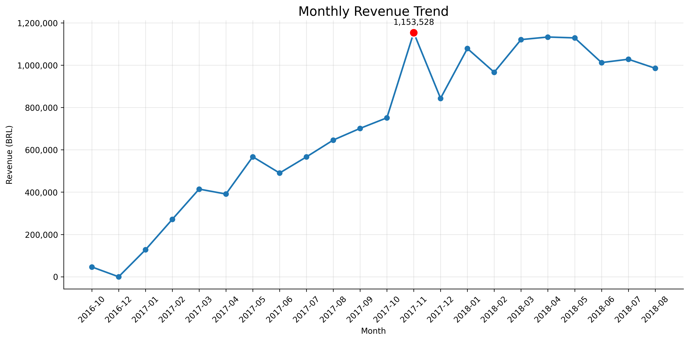
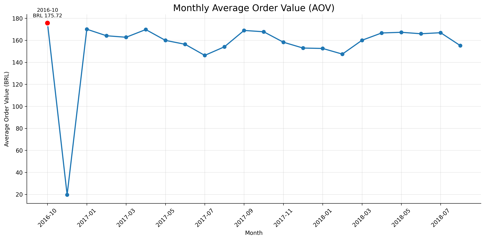

# Chapter 2 – Sales Performance

## 2.1 Business Question

How did sales performance change over time, and what primarily drove business growth?

---

## 2.2 Data Validation

Before analyzing sales trends, the dataset was validated to ensure that the time series was suitable for comparison.

- The dataset covers orders from September 2016 to October 2018.
- November 2016 contains no recorded orders.
- September and October 2018 contain only 16 and 4 orders respectively.
- These incomplete months were excluded from the trend analysis.
- Only delivered orders were included in the sales analysis.

---

## 2.3 Monthly Revenue

Monthly revenue was calculated using customer payment values from the `order_payments` table.

```sql
SELECT
    strftime('%Y-%m', o.order_purchase_timestamp) AS month,
    SUM(op.payment_value) AS revenue
FROM orders o
JOIN order_payments op
    ON o.order_id = op.order_id
WHERE
    o.order_status = 'delivered'
GROUP BY
    strftime('%Y-%m', o.order_purchase_timestamp)
ORDER BY
    month;
```


Monthly revenue increased substantially over the observed period, reaching its highest level in November 2017 at approximately **BRL 1.15 million**.

---

## 2.4 Monthly Orders

Monthly order volume was calculated using completed orders.

```sql
SELECT
    strftime('%Y-%m', order_purchase_timestamp) AS month,
    COUNT(order_id) AS total_orders
FROM orders
WHERE
    order_status = 'delivered'
GROUP BY
    strftime('%Y-%m', order_purchase_timestamp)
ORDER BY
    month;
```


Order volume followed a similar upward pattern, increasing from hundreds of monthly orders in early 2017 to more than 6,000 orders per month during much of 2018.

The highest monthly order volume occurred in **November 2017 with 7,289 delivered orders**.

---

## 2.5 Average Order Value

Average Order Value (AOV) was analyzed to determine whether revenue growth was driven by higher spending per order or by increasing transaction volume.

Because an order may contain multiple payment records, payment values were first aggregated at the order level before calculating the monthly average.

```sql
SELECT
    strftime('%Y-%m', o.order_purchase_timestamp) AS month,
    AVG(p.order_total) AS average_order_value
FROM orders o
JOIN (
    SELECT
        order_id,
        SUM(payment_value) AS order_total
    FROM order_payments
    GROUP BY order_id
) p
    ON o.order_id = p.order_id
WHERE
    o.order_status = 'delivered'
GROUP BY
    strftime('%Y-%m', o.order_purchase_timestamp)
ORDER BY
    month;
```


Average Order Value remained relatively stable compared with the substantial increase in revenue and order volume.

This indicates that sales growth was driven primarily by increasing transaction volume rather than substantially higher spending per order.

---

## 2.6 Findings

- Revenue and delivered order volume increased substantially over the observed period.
- Revenue and orders followed broadly similar growth patterns.
- Average Order Value remained relatively stable compared with the increase in revenue and order volume.
- This indicates that revenue growth was primarily associated with increasing transaction volume rather than higher spending per order.

---

## 2.7 Business Insight

The business experienced substantial sales growth, driven mainly by an increase in completed order volume.

While revenue increased considerably, Average Order Value remained relatively stable. This suggests that the business expanded primarily by processing more transactions rather than generating substantially higher spending from each order.

The following chapters examine which product categories and customer patterns were associated with this growth.
